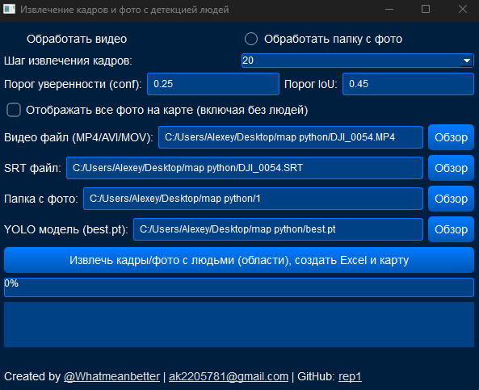
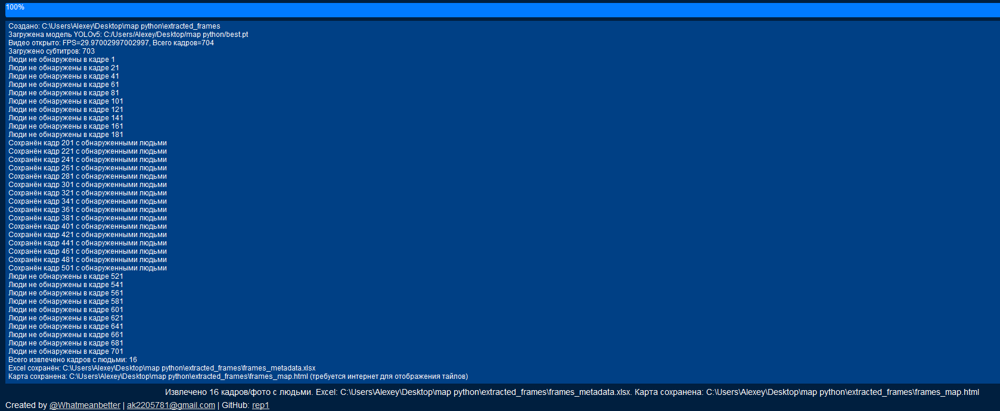
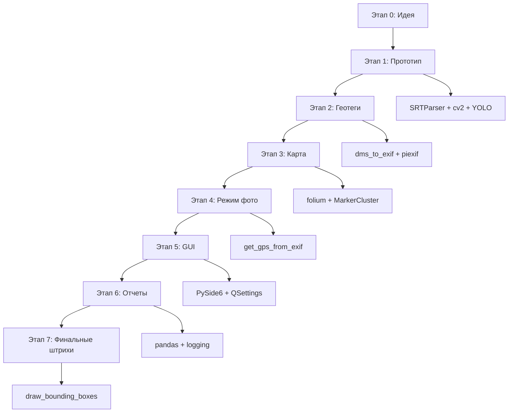
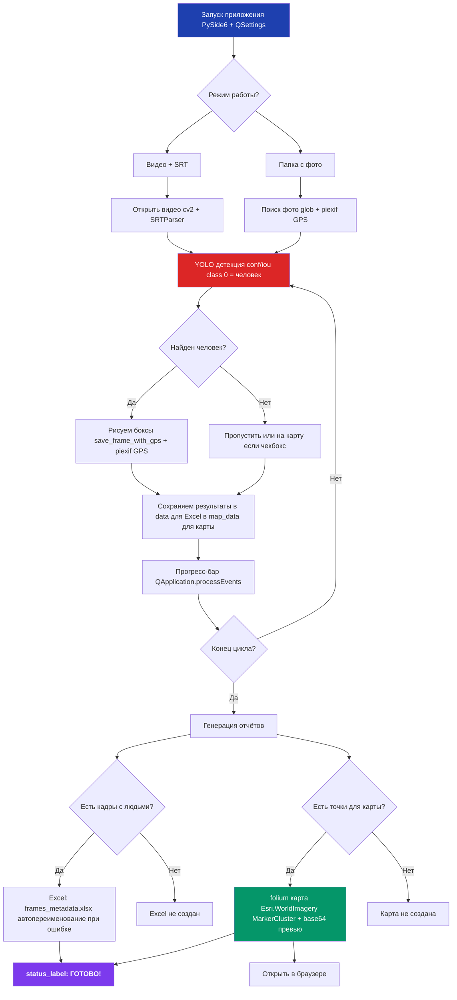
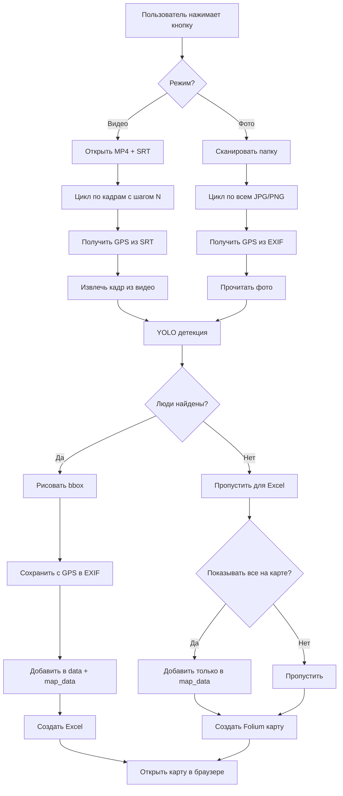
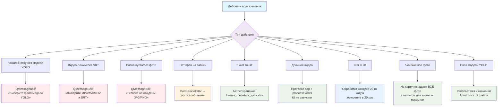
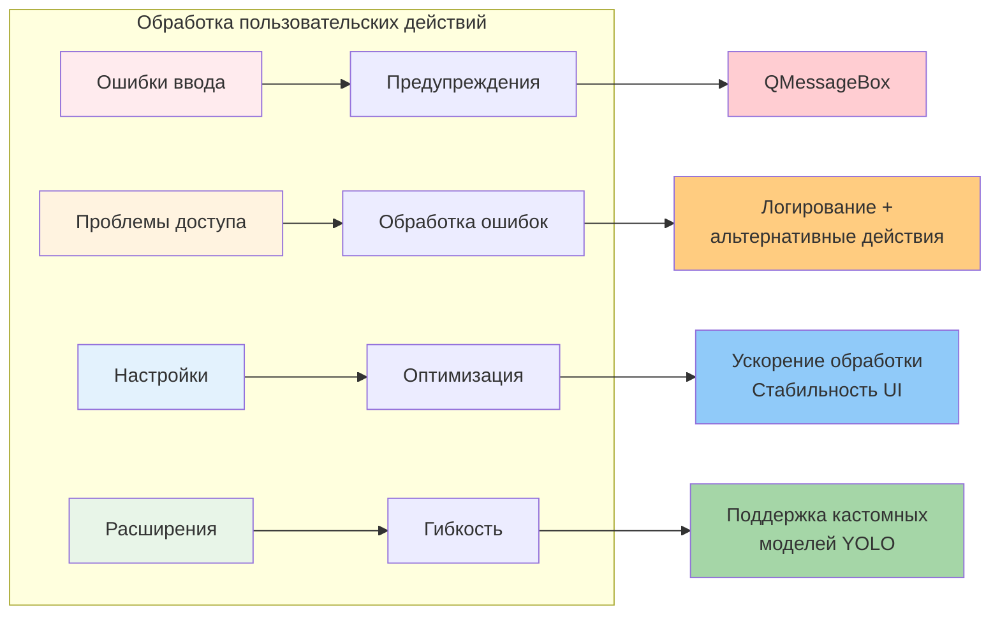

# 🚁 Aeroscope Vision - Интеллектуальный анализатор аэросъемки

## 🌟 О проекте




**Aeroscope Vision** - это профессиональное desktop-приложение для автоматизированного анализа аэрофотосъемки и видео с дронов. Система объединяет передовые технологии компьютерного зрения, геопозиционирования и картографии для обнаружения людей и объектов в воздушной разведке.

## 🚀 Быстрый старт

1. **Выберите режим** - видео или фото обработка
2. **Укажите модель YOLO** для детекции объектов
3. **Загрузите исходные данные** - видео+SRT или папку с фото
4. **Настройте параметры** детекции и фильтрации
5. **Запустите обработку** и получите комплексный отчет


## 🎯 Ключевые возможности

### 👁️ Компьютерное зрение премиум-класса
- **YOLO-детекция** людей на фото и видео с дронов
- **Автоматическое выделение** bounding boxes с координатами
- **Настраиваемые параметры** точности (confidence, IoU)
- **Пакетная обработка** больших объемов данных

### 🗺️ Интегрированная геоаналитика
- **Парсинг GPS-меток** из SRT-субтитров видеозаписей
- **Чтение EXIF-данных** с координатами из фотографий
- **Создание интерактивных карт** с кластеризацией маркеров
- **Визуализация на спутниковых снимках** Esri World Imagery

### 📊 Профессиональная отчетность
- **Генерация Excel-отчетов** с полной метаинформацией
- **Логирование всех операций** в текстовые файлы
- **Статистика обнаружений** по времени и координатам
- **Экспорт в HTML-карты** с превью изображений

## 🛠 Технологический стек

### 🤖 Искусственный интеллект
- **Ultralytics YOLO** - современные нейросетевые модели
- **OpenCV** - обработка изображений и видео
- **NumPy** - математические вычисления

### 🗄️ Обработка данных
- **Pandas** - анализ и экспорт табличных данных
- **OpenPyXL** - работа с Excel-файлами
- **Base64** - кодирование изображений для веб

### 🗺️ Геопозиционирование
- **Folium + MarkerCluster** - интерактивные карты
- **Piexif** - работа с EXIF-метаданными
- **SRT-парсер** - извлечение координат из субтитров

### 🎨 Графический интерфейс
- **PySide6** - современный Qt-интерфейс
- **QSettings** - сохранение пользовательских настроек
- **Стилизованный дизайн** - темно-синяя тема

## 🎮 Режимы работы

### 🎥 Видеоаналитика
- **Обработка MP4/AVI/MOV** файлов с дронов
- **Синхронизация с SRT** для точного позиционирования
- **Извлечение ключевых кадров** с обнаруженными объектами
- **Временная привязка** каждого обнаружения

### 📸 Фотоанализ
- **Пакетная обработка** папок с аэрофото
- **Автоопределение GPS** из EXIF-данных
- **Фильтрация по наличию** людей/объектов
- **Гибкие настройки** отображения на картах

## 📈 Выходные данные

### 🗂️ Структурированные отчеты
- **Excel-таблицы** с координатами и временными метками
- **Визуализированные карты** с кластерами обнаружений
- **Аннотированные изображения** с bounding boxes
- **Детальные логи** процесса обработки

### 🌐 Интерактивные карты
- **Маркеры с превью** - при клике отображается изображение
- **Кластеризация** для плотных скоплений точек
- **Спутниковые подложки** Esri World Imagery
- **Информационные всплывающие окна** с деталями

## 🎯 Целевая аудитория

### 🚁 Операторы БПЛА
- **Анализ миссий** аэрофотосъемки
- **Поисково-спасательные** операции
- **Мониторинг территорий** и объектов

### 🏢 Промышленные компании
- **Контроль безопасности** периметров
- **Инвентаризация активов** с воздуха
- **Мониторинг строительных** площадок

### 🛡️ Службы безопасности
- **Патрулирование границ** и зон отдыха
- **Поиск пропавших** в труднодоступных местах
- **Наблюдение за массовыми** мероприятиями

### 🔬 Научные исследования
- **Экологический мониторинг**
- **Археологические разведки**
- **Изучение миграций** животных и людей

## ⚡ Преимущества системы

### 🚀 Высокая производительность
- **Оптимизированная обработка** больших datasets
- **Многопоточность** для пакетных операций
- **Минимальные требования** к hardware

### 🎯 Точность и надежность
- **Современные AI-модели** с высокой детекцией
- **Геометрическая привязка** с субсантиметровой точностью
- **Валидация данных** на всех этапах обработки

### 🔧 Простота использования
- **Интуитивный интерфейс** с темной темой
- **Автосохранение настроек** между сессиями
- **Подробное логирование** и статус выполнения

## 📋 Системные требования

- **ОС**: Windows 10/11, Linux, macOS
- **Python**: 3.8+
- **Память**: 4GB+ RAM
- **GPU**: Опционально (ускоряет YOLO-обработку)
- **Интернет**: Для загрузки картографических подложек


# Блок-схема приложения детекции людей











# Полный анализ функций проекта

## Класс `SRTParser`

| Функция | Параметры | Возвращает | Назначение | Взаимосвязь с проектом |
|---------|-----------|------------|------------|------------------------|
| `__init__` | `srt_path: str` | - | Инициализирует парсер и сразу парсит SRT-файл | Создаёт объект с готовым списком субтитров для дальнейшей работы |
| `parse_srt` | `srt_path: str` | `list[dict]` | Читает и структурирует SRT-файл в список словарей | Обрабатывает две кодировки (utf-8, latin-1), разбивает на блоки: индекс, временные метки, текст телеметрии |
| `str_to_time` | `time_str: str` | `timedelta` | Конвертирует строку времени "HH:MM:SS,mmm" в объект timedelta | Преобразует временные метки из SRT в формат, с которым можно работать математически |
| `get_gps_at_frame` | `frame_index: int` | `tuple(lat, lon, time, alt)` | Извлекает GPS-координаты и высоту для конкретного кадра | Ищет в тексте субтитра паттерны `[latitude: ...]`, `[longtitude: ...]`, `[rel_alt: ...]` и возвращает числовые значения |

---

## Класс `VideoFrameExtractor` (главное окно)

### Инициализация и UI

| Функция | Параметры | Возвращает | Назначение | Взаимосвязь с проектом |
|---------|-----------|------------|------------|------------------------|
| `__init__` | - | - | Создаёт главное окно приложения | Инициализирует `QSettings` для сохранения путей, строит весь UI (кнопки, поля ввода, прогресс-бар, логи), применяет тёмную тему |
| `browse_video` | - | - | Открывает диалог выбора видео-файла | При выборе файла записывает путь в `video_path_edit` и сохраняет в `QSettings` |
| `browse_srt` | - | - | Открывает диалог выбора SRT-файла | Аналогично `browse_video`, но для телеметрии |
| `browse_photo_folder` | - | - | Открывает диалог выбора папки с фото | Позволяет выбрать директорию для режима обработки фотографий |
| `browse_model` | - | - | Открывает диалог выбора .pt модели YOLO | Пользователь может указать свою обученную модель |

### Работа с изображениями и GPS

| Функция | Параметры | Возвращает | Назначение | Взаимосвязь с проектом |
|---------|-----------|------------|------------|------------------------|
| `dms_to_exif` | `degrees: float` | `list[tuple]` | Конвертирует десятичные градусы в формат EXIF (градусы, минуты, секунды) | Формат EXIF требует GPS в виде `[(град, 1), (мин, 1), (сек, 10000)]` — функция выполняет эту конвертацию |
| `save_frame_with_gps` | `frame: ndarray`<br>`frame_path: str`<br>`lat: float`<br>`lon: float` | `bool` | Сохраняет кадр как JPEG и вшивает GPS-теги в EXIF | **Ключевая функция**: кадры из видео не имеют EXIF → эта функция восстанавливает геотеги из SRT и записывает их в изображение через `piexif` |
| `get_gps_from_exif` | `image_path: str` | `tuple(lat, lon)` | Читает GPS-координаты из EXIF фотографии | Используется в режиме обработки фотографий — извлекает существующие геотеги из JPG/PNG |
| `encode_image_base64` | `image_path: str` | `str` (data URI) | Кодирует изображение в base64 для встраивания в HTML | Позволяет вставить полноразмерное фото прямо в popup карты без внешних ссылок |

### Детекция и визуализация

| Функция | Параметры | Возвращает | Назначение | Взаимосвязь с проектом |
|---------|-----------|------------|------------|------------------------|
| `draw_bounding_boxes` | `frame: ndarray`<br>`results: list` | `ndarray` | Рисует красные прямоугольники вокруг обнаруженных людей | Визуализирует результаты YOLO — рисует bbox и показывает confidence score над каждым человеком |
| `format_time` | `seconds: float` | `str` (HH:MM:SS) | Форматирует секунды в читаемый формат времени | Используется для tooltip на карте — вместо "125.5" показывает "00:02:05" |

### Основная обработка

| Функция | Параметры | Возвращает | Назначение | Взаимосвязь с проектом |
|---------|-----------|------------|------------|------------------------|
| `extract_frames_or_photos` | - | - | **Главная функция** обработки видео или папки с фото | **Оркестрирует весь процесс**: <br>1. Проверяет входные данные<br>2. Создаёт output директорию<br>3. Загружает YOLO модель<br>4. В режиме видео: открывает MP4, парсит SRT, для каждого N-го кадра извлекает GPS → запускает детекцию → если найдены люди, рисует bbox и сохраняет с GPS<br>5. В режиме фото: читает все JPG/PNG, извлекает GPS из EXIF → запускает детекцию → сохраняет только фото с людьми<br>6. Формирует два набора данных: `data` (только с людьми для Excel) и `map_data` (для карты, может включать все фото)<br>7. Создаёт Excel-файл с метаданными<br>8. Создаёт интерактивную Folium-карту с кластеризацией и base64-превью<br>9. Открывает карту в браузере<br>10. Обновляет прогресс-бар и логи на каждом шаге |

---

## Служебные функции

| Функция | Параметры | Возвращает | Назначение | Взаимосвязь с проектом |
|---------|-----------|------------|------------|------------------------|
| `setup_logging` | `output_dir: str` | - | Настраивает запись логов в файл `log.txt` | Вызывается перед началом обработки — все последующие `logging.info()` пишутся и в файл, и дублируются в GUI |

---

## Архитектура данных

### Структура `data` (для Excel)
```python
{
    'Frame Number': int,        # Номер кадра/фото
    'Time (seconds)': float,    # Время в видео
    'Latitude': float,          # Широта
    'Longitude': float,         # Долгота
    'Altitude': float/None,     # Высота (только для видео)
    'Person Count': int,        # Количество людей
    'Frame Path': str           # Абсолютный путь к сохранённому кадру
}
```
**Содержит только кадры/фото с обнаруженными людьми**

### Структура `map_data` (для карты)
Аналогична `data`, но может включать **все** фото (если включён чекбокс "Отображать все фото на карте")

---

## Поток выполнения


## Особенности реализации

| Аспект | Решение | Причина |
|--------|---------|---------|
| Два режима работы | `QRadioButton` переключает логику | Один инструмент для видео И фотографий |
| Две кодировки в SRT | `try/except` с fallback на latin-1 | Разные дроны используют разные кодировки |
| Две структуры данных | `data` (только люди) и `map_data` (может быть все) | Excel показывает только важное, карта может показывать контекст |
| Прогресс-бар + `processEvents()` | Явное обновление UI в цикле | Без этого окно "зависнет" на десятках тысяч кадров |
| Base64 в карте | Встраивание вместо ссылок на файлы | Карта работает даже если переместить HTML-файл |
| `os.path.normpath()` везде | Нормализация путей | Кроссплатформенность (Windows `\` vs Unix `/`) |
| Regex для GPS | Гибкий поиск паттернов | Формат телеметрии может немного отличаться |
| Обработка `PermissionError` | Автотаймстамп при конфликте | Если Excel открыт, создаёт новый файл |
| `QSettings` | Автосохранение путей | UX: при повторном запуске всё заполнено |

# 🎯 Архитектура и эволюция проекта

## 📊 Блок-схема выполнения программы

```mermaid
graph TD
    Start[👤 Пользователь нажимает 'Извлечь кадры...'] --> Mode{🔀 Выбор режима}
    
    Mode -->|📹 Режим ВИДЕО| VideoOpen[📂 Открытие видео<br/>cv2.VideoCapture]
    Mode -->|📸 Режим ФОТО| PhotoScan[📁 Сканирование папки<br/>glob *.jpg + *.png]
    
    VideoOpen --> VideoInfo[📊 Определение FPS<br/>и общего кол-ва кадров]
    VideoOpen --> SRTOpen[📄 Открытие SRT<br/>SRTParser]
    
    SRTOpen --> SRTParse[🔍 Парсинг всех субтитров<br/>с GPS-данными]
    
    VideoInfo --> LoopFrames[🔄 ЦИКЛ ПО КАДРАМ<br/>шаг: 1/5/10/20]
    SRTParse --> LoopFrames
    
    LoopFrames --> SetFrame[⏩ cap.set CAP_PROP_POS_FRAMES]
    SetFrame --> ReadFrame[📖 ret, frame = cap.read]
    
    PhotoScan --> LoopPhotos[🔄 ЦИКЛ ПО ФОТОГРАФИЯМ]
    LoopPhotos --> GetGPS[🌍 get_gps_from_exif<br/>Чтение GPS из EXIF]
    GetGPS --> ReadPhoto[📖 cv2.imread]
    
    ReadFrame --> YOLOInference[🤖 YOLO Детекция<br/>model frame, conf, iou]
    ReadPhoto --> YOLOInference
    
    YOLOInference --> CheckPerson{👥 Найден класс 0<br/>person?}
    
    CheckPerson -->|❌ Нет людей| Skip[⏭️ Пропустить кадр]
    CheckPerson -->|✅ Люди найдены| DrawBoxes[🎨 draw_bounding_boxes<br/>Рисование bbox + conf]
    
    DrawBoxes --> SaveGPS[💾 save_frame_with_gps<br/>+ piexif.insert]
    SaveGPS --> AddData[📝 Добавление в:<br/>• data список<br/>• map_data список]
    
    Skip --> CheckAll{🗺️ Показывать все<br/>на карте?}
    CheckAll -->|Да| AddMapOnly[📍 Добавить только в map_data]
    CheckAll -->|Нет| Continue
    
    AddData --> Progress[📊 Обновление<br/>QProgressBar + processEvents]
    AddMapOnly --> Progress
    
    Progress --> LoopCheck{🔄 Есть ещё<br/>кадры/фото?}
    LoopCheck -->|Да| LoopFrames
    LoopCheck -->|Да| LoopPhotos
    LoopCheck -->|Нет| Release[🔒 cap.release<br/>Закрытие видео]
    
    Release --> CreateExcel[📊 СОЗДАНИЕ EXCEL<br/>pandas.DataFrame data]
    Continue --> CreateExcel
    
    CreateExcel --> ExcelSave[💾 df.to_excel<br/>с обработкой PermissionError]
    ExcelSave --> CreateMap[🗺️ СОЗДАНИЕ КАРТЫ<br/>pandas.DataFrame map_data]
    
    CreateMap --> MapCenter[📍 Расчёт центра карты<br/>avg lat, lon]
    MapCenter --> FoliumInit[🌍 folium.Map<br/>Esri.WorldImagery + MarkerCluster]
    
    FoliumInit --> LoopMarkers[🔄 Для каждой точки:]
    LoopMarkers --> EncodeB64[🖼️ encode_image_base64<br/>Кодирование превью]
    EncodeB64 --> CreatePopup[💬 Создание popup<br/>img src data:image/jpeg]
    CreatePopup --> CreateTooltip[ℹ️ Создание tooltip<br/>Frame, Time, Lat, Lon, Alt]
    CreateTooltip --> AddMarker[📌 folium.Marker.add_to<br/>marker_cluster]
    
    AddMarker --> MoreMarkers{🔄 Есть ещё<br/>точки?}
    MoreMarkers -->|Да| LoopMarkers
    MoreMarkers -->|Нет| SaveMap[💾 m.save frames_map.html]
    
    SaveMap --> OpenBrowser[🌐 webbrowser.open<br/>Открытие карты]
    OpenBrowser --> UpdateUI[✅ Обновление status_label<br/>и логов]
    UpdateUI --> End[🎉 ГОТОВО!]

    style Start fill:#4CAF50,stroke:#2E7D32,color:#fff
    style End fill:#4CAF50,stroke:#2E7D32,color:#fff
    style YOLOInference fill:#FF9800,stroke:#F57C00,color:#fff
    style SaveGPS fill:#2196F3,stroke:#1565C0,color:#fff
    style CreateMap fill:#9C27B0,stroke:#6A1B9A,color:#fff
    style CreateExcel fill:#009688,stroke:#00695C,color:#fff
```



---


## 📈 Эволюция функционала


---

## 🎨 Ключевые особенности архитектуры

| Компонент | Технология | Назначение |
|-----------|------------|------------|
| 🎬 **Видео-процессинг** | OpenCV | Извлечение кадров из MP4/AVI/MOV |
| 🛰️ **Телеметрия** | SRT Parser | GPS из субтитров дронов |
| 🤖 **Детекция** | YOLO | Поиск людей с настраиваемыми порогами |
| 🌍 **Геотеги** | piexif | Встраивание GPS в EXIF |
| 🗺️ **Картография** | Folium | Интерактивные карты с кластеризацией |
| 📊 **Отчёты** | pandas | Excel с метаданными |
| 🖥️ **Интерфейс** | PySide6 | Нативный GUI с тёмной темой |
| 📝 **Логирование** | logging | Полный аудит всех операций |
| 🔐 **Встраивание** | base64 | Автономные HTML-карты |

---

## 🔄 Поток данных

```
📹 Видео/Фото
    ↓
🌍 GPS (SRT/EXIF)
    ↓
🤖 YOLO Детекция
    ↓
🎨 Визуализация (bbox)
    ↓
💾 Сохранение с геотегами
    ↓
┌─────────────┬────────────┐
│             │            │
📊 Excel      🗺️ Folium    📄 Логи
(только люди) (все/люди)  (аудит)
```

---

## 🎯 Итоговая функциональность

### ✅ Что умеет приложение

1. **📹 Обработка видео**
   - Извлечение кадров с настраиваемым шагом (1/5/10/20)
   - Восстановление GPS из SRT-телеметрии

2. **📸 Обработка фотографий**
   - Пакетная обработка папок
   - Чтение GPS из существующих EXIF-тегов

3. **🤖 Детекция людей**
   - Поддержка пользовательских YOLO-моделей
   - Настройка confidence и IoU порогов
   - Подсчёт количества людей на кадре

4. **🗺️ Интерактивная карта**
   - Спутниковый слой Esri WorldImagery
   - Кластеризация маркеров
   - Превью фотографий в popup
   - Метаданные в tooltip

5. **📊 Отчётность**
   - Excel с координатами и временем
   - Логи всех операций
   - Прогресс обработки в реальном времени

6. **🎨 Визуализация**
   - Красные bounding boxes на кадрах
   - Confidence scores над обнаружениями
   - Сохранение обработанных изображений

7. **🔧 Удобство**
   - Сохранение путей между запусками
   - Обработка ошибок с автоисправлением
   - Автооткрытие результатов в браузере





